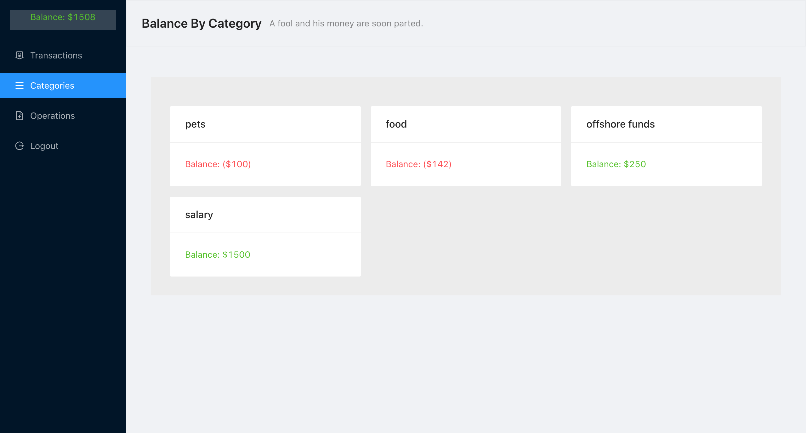
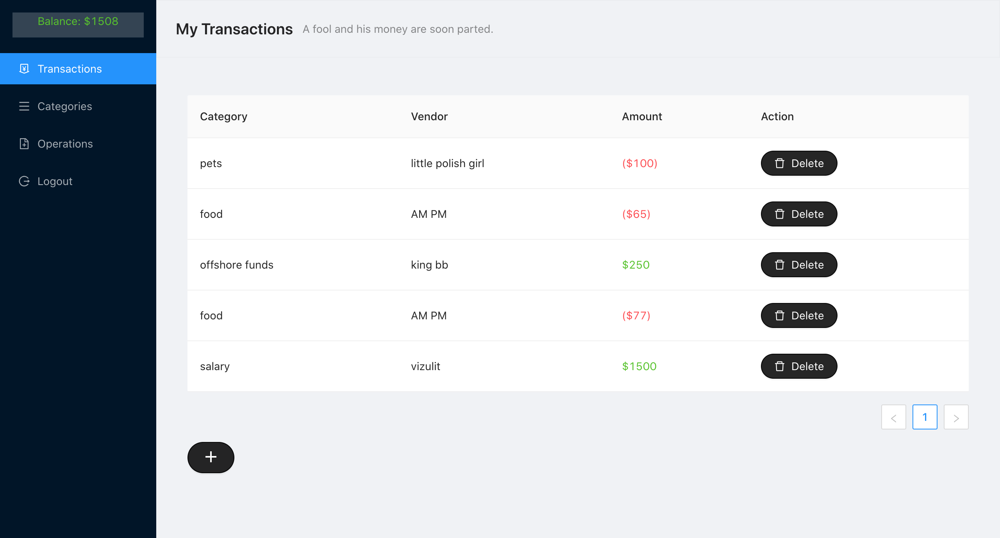
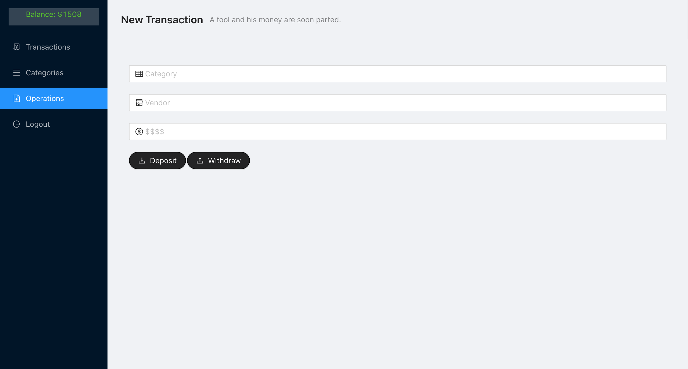
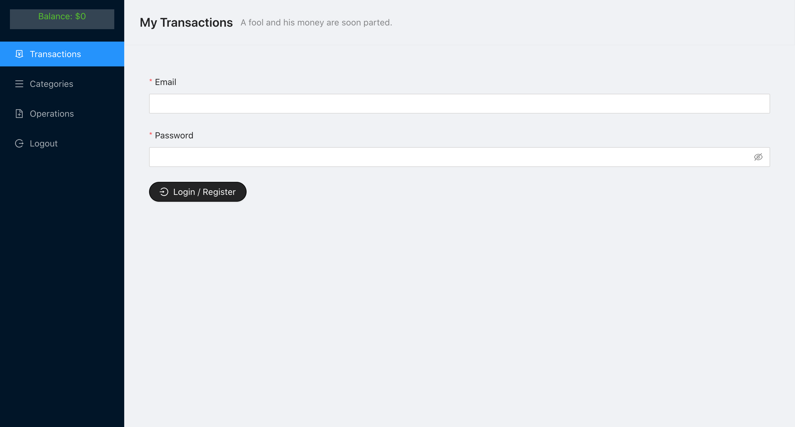

# Personal Expense Manager
- This project was bootstrapped with [Create React App](https://github.com/facebook/create-react-app), adding on to it express-mongoose server.

## General description
- Expense management web app.
- Node.js server serving React.Js app. 
- The server is utilizing es6 features(through Babel).
- UI by [Ant Design](https://ant.design/).

## Production deployment / production-like env.
- In order to serve React app through the server uncomment specified line in server.js.

## Starting the server 
- Run `yarn start:server` (nodemon keeps the process alive).

## Start
- Run `yarn start` on a separate terminal tab than the server's.
- Server loads slower than the client side on dev env so make sure the server finished init.
- Runs the app in the development mode. 
- Open [http://localhost:3000](http://localhost:3000) to view it in the browser.

- The page will reload if you make edits. 
- You will also see any lint errors in the console.

## App screenshots
<h1 align="center">
    
    
    
    
</h1>

## Roadmap
- Migrating Operations to a modal on transactions route.
- Upgrade categories dashboard to use recharts.
